SD-WAN Programmability Lab Guide 
================================


Table of Contents
=================

   * [Introduction](#introduction)
      * [vManage REST APIs](#vmanage-rest-apis)
      * [API Categories](#api-categories)
   * [Lab Overview](#lab-overview)
      * [Platforms and software used](#platforms-and-software-used)
      * [Accessing the lab](#accessing-the-lab)
   * [Setup Instructions:](#setup-instructions)
   * [Lab Flow/Use cases](#lab-flowuse-cases)
   * [Usecase-1: Device and Monitoring APIs](#usecase-1-device-and-monitoring-apis)
      * [Objective](#objective)
      * [Code Components](#code-components)
      * [Resource URL Structure Components](#resource-url-structure-components)
      * [List Devices](#list-devices)
      * [Control Status](#control-status)
      * [Interface Status](#interface-status)
      * [Device Counters](#device-counters)
      * [System Status](#system-status)
      * [Conclusion](#conclusion)
   * [Usecase-2: Configuration APIs](#usecase-2-configuration-apis)
      * [Objective](#objective-1)
      * [Resource URL Structure Components](#resource-url-structure-components-1)
      * [Templates list](#templates-list)
      * [Centralized Policies List](#centralized-policies-list)
      * [Activate Central Policy](#activate-central-policy)
      * [Modify Preferred Color in App Route Policy](#modify-preferred-color-in-app-route-policy)
         * [Code Components](#code-components-1)
      * [Conclusion](#conclusion-1)
   * [Usecase-3: App route statistics (Latency/Loss/Jitter)](#usecase-3-app-route-statistics-latencylossjitter)
      * [Objective](#objective-2)
      * [Aggregation API Constructs](#aggregation-api-constructs)
      * [Resource URL Structure Components](#resource-url-structure-components-2)
      * [App Route Query Fields](#app-route-query-fields)
      * [Aggregation API Query Payload](#aggregation-api-query-payload)
         * [Example-1](#example-1)
         * [Example-2](#example-2)
      * [POST Operation](#post-operation)
      * [Conclusion](#conclusion-2)
   * [Usecase-4: Alarms APIs](#usecase-4-alarms-apis)
      * [Objective](#objective-3)
      * [Resource URL Structure Components](#resource-url-structure-components-3)
      * [Query Payload](#query-payload)
         * [Example-1](#example-1-1)
         * [Example-2](#example-2-1)
         * [Example-3](#example-3)
      * [POST Operation](#post-operation-1)
      * [Sample Responses](#sample-responses)
         * [Example-1](#example-1-2)
      * [Conclusion](#conclusion-3)
   * [Usecase-5: Webhook](#usecase-5-webhook)
      * [Objective](#objective-4)
      * [Prerequisites](#prerequisites)
      * [Configure](#configure)
      * [Notifications Dashboard](#notifications-dashboard)
      * [Set up Webhook server on Windows VM](#set-up-webhook-server-on-windows-vm)
      * [Enable Webhook Server](#enable-webhook-server)
      * [Alarms on vManage](#alarms-on-vmanage)
      * [Conclusion](#conclusion-4)
   * [References](#references)
  
# Introduction

## vManage REST APIs

  - REpresentational State Transfer (REST) is an architecture style for designing web-services applications.
  - REST architecture uses a stateless, client–server, cacheable communications protocol.
  - vManage API Documentation is built-in at https://<vmanage-ip:port>/apidocs
  - Test API calls can be tried out from Swagger UI at /apidocs

## API Categories

- In REST API terminology, each of these features or operations is called a Resource URIs. 
- A resource is an object(API end point) with a type, associated data, relationships to other resources, and a set of methods that operate on it.
- On vManage, resources are grouped into collections and below is that list.

| Resource Collection | Description |
| ------ | ------ |		
| Device Action | Manage device actions viz. reboot, upgrade, lxcinstall etc.|	
|Device Inventory | Retrieving device inventory information, including serial numbers and system status.  |
| Administration | 	Managing users and user groups, viewing audit logs, and managing the local vManage server.|
| Certificate Management | Managing certificates for controllers and edge routers. |
| Configuration	| Creating feature and device configuration templates, retrieving the configurations in existing templates.|
| Monitoring	| Viewing operational status, statistics, and other information about devices in the overlay network.|
| Real-Time Monitoring	| Retrieving, viewing, and managing real-time statistics and traffic information.|
| Troubleshooting Tools | Troubleshooting devices, for determining the effect of policy, for updating software, and for retrieving software version information. |

# Lab Overview

## Platforms and software used

| Component | Software Version |
| ------ | ------ |
| vManage, vSmart and vBond  | 20.1.1 |
| cEdge (CSR1000v) | 17.2.1 |
| vEdge (vedge-cloud) | 20.1.1 |

##	 Accessing the lab

**Note:** This lab utilizes the dCloud SD-WAN Sandbox so, please check with instructor for dCloud sandbox details. 


**Step-1**

Connect to your dCloud session by opening your Cisco AnyConnect client and
providing the following information to connect into the lab session.

| Parameter | Input |
| ------ | ------ |
| AnyConnect Host | **Instructor Provided** |
| Username | **Instructor Provided** |
| Password| **Instructor Provided** |

**Step-2**

**RDP**


For MAC laptop users download link:
https://itunes.apple.com/us/app/microsoft-remote-desktop-10/id1295203466 

- Open your local Remote Desktop Client application and connect to the lab Jumphost
- This Windows VM (Jumphost) has access to all network devices and we will also run our python scripts on this VM.

| Parameter | Input |
| ------ | ------ |
| Host | **Instructor Provided** |
| Username | **Instructor Provided**  |
| Password| **Instructor Provided** |

Click ignore/continue if prompted with an invalid certificate warning.


This will place you onto “WKST1” which is the launching point for all lab tasks.

**Step-3**

- Once you are on windows machine, launch the Google Chrome browser. 

- Open the box link `cs.co/sevt-2020` in google chrome browser and click on download. 

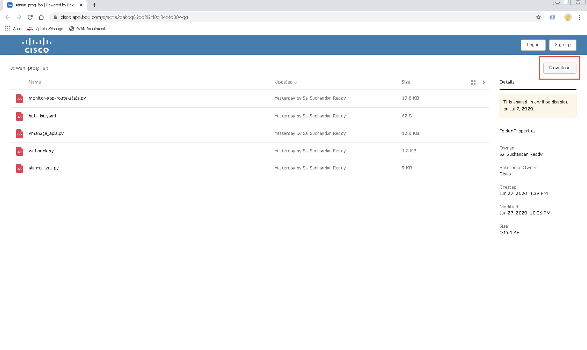 

Go to Downloads directory on file explorer and right click on the zip file `sdwan_prog_lab.zip` and select `extract all` as seen below 

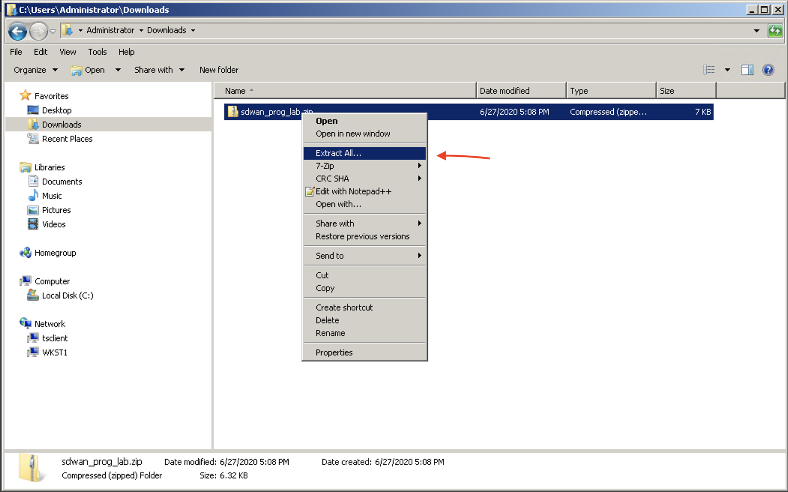

Provide **C:\Users\Administrator\Desktop** as path and select Extract option. 

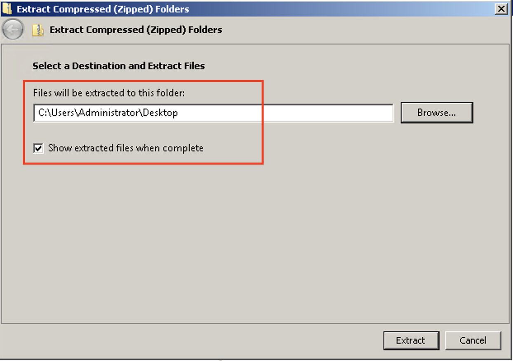 

# Setup Instructions:

Launch **Command Prompt** from Windows VM Desktop using below shortcut.


**Step-1**

Set `PATH` env variable in the cmd prompt so that we can run **pip3** to install all the packages needed for python scripts.

Command to set PATH env for current session:

`set PATH=%PATH%;C:\Python3\Scripts\`

Command to set PATH env permanently:

`setx PATH "%PATH%;C:\Python3\Scripts\"`

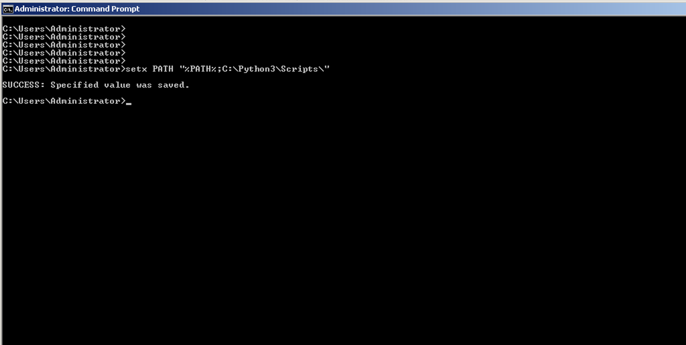

**Step-2**

Once PATH env variable is updated, run cmd `cd C:\Users\Administrator\Desktop\sdwan_prog_lab` on command prompt.

**Step-3**

Now install python package requirements by using the command `pip3 install -r requirements.txt`

**Step-4**

Run below commands using the vmanage ip address, port, login credentials from dcloud session details.

These commands should be run in command prompt to set the environment variables which stores vmanage login details. 

<pre>
set vmanage_host=<b>Instructor Provided</b>
set vmanage_port=<b>Instructor Provided</b>
set vmanage_username=<b>Instructor Provided</b>
set vmanage_password=<b>Instructor Provided</b>
</pre>

#	 Lab Flow/Use cases

The Lab begins with all devices in fabric being up and running. We use the python scripts to execute below REST API calls.

1.	Device and Monitoring APIs

	  -	Use CLI based python application script that leverages the REST APIs to retrieve Inventory data from vmanage and control connections, OMP peers, BFD sessions, System status of wan edge router.

2.	Configuration APIs

    - Use vManage APIs to retrieve list of templates and policies, activate/deactivate a policy, edit preferred color in specific Application Aware Routing Policy sequence.

3.	App Route Statistics APIs

    - Use Aggregation Query APIs to retrieve Application Aware Routing statistics (BFD statistics) for Overlay Tunnels and create report of average latency/loss/jitter and vQoE score.

4.	Alarms APIs

	  - Use Simple Query APIs to retrieve alarms of specific category and more details about consumed events which created specific alarm. 

5. Webhooks

	- 	Learn how to enable webhooks on vManage and write API route to consume the data sent from vManage to webhook server.

Now let's start with usecase-1 and learn how to use Device and Monitoring APIs

#	Usecase-1: Device and Monitoring APIs

## Objective 

How to retrieve devices list, control connection status, interface status, system status using vManage REST APIs.

## Code Components

Please note that this is a FYI section which includes code snippets and structure of CLI based python application script **vmanage_apis.py**. 

<details>
  <summary>Click to expand!</summary>

-	Python function that does login and authenticate with vManage instance

In `vmanage_apis.py` code , we have defined a class `Authentication` which has methods `get_jsessionid()` and `get_token()` 

## Authentication

Let's start by going through get_jsessionid() function which is used to retrieve authenticated session cookie which is used by vManage to validate subsequent API calls. 

Input parameters for **get_jsessionid()** are

-  vmanage_host
-  vmanage_port
-  username
-  password

On successful POST operation we get JSESSIONID or cookie which is used in future API calls by client. By nature REST API is stateless so we use JSESSIONID for doing session tracking.

After **Session Cookie** is recieved, starting from vManage 19.2 code, we need to run GET request to API endpoint `/dataservice/client/token` to retrieve the **Session Token**.  

Input parameters for **get_token()** are

- vmanage_host
- vmanage_port
- jesssion_id

### Code snip

```
class Authentication:

    @staticmethod
    def get_jsessionid(vmanage_host, vmanage_port, username, password):
        api = "/j_security_check"
        base_url = "https://%s:%s"%(vmanage_host, vmanage_port)
        url = base_url + api
        payload = {'j_username' : username, 'j_password' : password}
        
        response = requests.post(url=url, data=payload, verify=False)
        try:
            cookies = response.headers["Set-Cookie"]
            jsessionid = cookies.split(";")
            return(jsessionid[0])
        except:
            print("No valid JSESSION ID returned\n")
            exit()
       
    @staticmethod
    def get_token(vmanage_host, vmanage_port, jsessionid):
        headers = {'Cookie': jsessionid}
        base_url = "https://%s:%s"%(vmanage_host, vmanage_port)
        api = "/dataservice/client/token"
        url = base_url + api      
        response = requests.get(url=url, headers=headers, verify=False)
        if response.status_code == 200:
            return(response.text)
        else:
            return None

Auth = Authentication()
jsessionid = Auth.get_jsessionid(vmanage_host,vmanage_port,vmanage_username,vmanage_password)
token = Auth.get_token(vmanage_host,vmanage_port,jsessionid)

if token is not None:
    header = {'Content-Type': "application/json",'Cookie': jsessionid, 'X-XSRF-TOKEN': token}
else:
    header = {'Content-Type': "application/json",'Cookie': jsessionid}
```
</details>

**Note:**

API requests header for GET/POST/PUT/DELETE are
- For vManage **pre-19.2**  - Session Cookie (jsessionid)
- For vManage **post-19.2** - Session Cooke (jsessionid) and Token

<br>

Now let's have a look at resource URL structure components that are used in GET/POST/PUT/DELETE requests.

## Resource URL Structure Components

Resource URL to retrieve the inventory from the vmanage is `https://<vmanage-ip:port>/dataservice/device`

| Component | Description |
| ------ | ------ |
| https://  | Protocol over which data is sent  between client and server |
| Server or Host  | Resolves to the IP and port to which to connect, example : "<vmanage-ip:port>" |
| Resource | The location of the data or object of  interest, example : "/device" |
| Parameters  | Details to scope, filter, or clarify a request. Often optional|

Example for Parameters
  -   URL : `https://<vmanage-ip:port>/dataservice/device/bfd/state/device?deviceId=1.1.1.7`
  -   "?deviceId=1.1.1.7" is used to filter out bfd state for device with **system-ip/deviceId** = 1.1.1.7

**Note:**  All REST API calls to vmanage contains the root "/dataservice".
	
**Step-1:**

<pre>
Open Windows Command prompt and execute the command <b>py -3.7 vmanage_apis.py</b> to see the list of available options<br>in this CLI based python application script. 
</pre>

**Sample Response**

```

C:\Users\Administrator\Desktop\sdwan_prog_lab>py -3.7 vmanage_apis.py
Usage: vmanage_apis.py [OPTIONS] COMMAND [ARGS]...

  Command line tool for monitoring Cisco SD-WAN solution components.

Options:
  --help  Show this message and exit.

Commands:
  attached-devices  Retrieve and return devices associated to a template.
  control-status    Retrieve and return information about Control status of...
  detach            Detach a device template.
  device-counters   Retrieve information about Device Counters of network...
  device-list       Retrieve and return network devices list.
  interface-status  Retrieve and return information about Interface status...
  system-status     Retrieve and return information about System status of...
  template-list     Retrieve and return templates list.
```

Now let’s make an API call to fetch the list of devices in the SD-WAN fabric. 

Resource URI for this is "/device" so, URL to fetch devices is  `https://vmanage-ip:port/dataservice/device`

## List Devices

Once authentication is done with the vManage using `get_jessiond()` and `get_token()` functions, we will run the GET request to retrieve list of all the devices in the fabric and store the JSON data that is returned by the API in the response variable.

Now we extract the `data` portion of the JSON using `response.json()['data']` and create a table with required fields in response.
 
**Step-2:** 	

<pre>
On windows command prompt, run the command <b>py -3.7 vmanage_apis.py device-list</b> to retrieve the list of devices<br>and print information such as Host-name, Site-ID, system-ip etc.. in table format.
</pre>
   
**Sample Response**  
  
```
C:\Users\Administrator\Desktop\sdwan_prog_lab>py -3.7 vmanage_apis.py device-list

Retrieving the devices.
╒═════════════╤═══════════════╤══════════════════════════════════════════╤═════════════╤═══════════╤════════════════╤═════════════════╕
│ Host-Name   │ Device Type   │ Device ID                                │ System IP   │   Site ID │ Version        │ Device Model    │
╞═════════════╪═══════════════╪══════════════════════════════════════════╪═════════════╪═══════════╪════════════════╪═════════════════╡
│ vManage     │ vmanage       │ 5271ea7c-edb1-420b-be9a-4d25756785bd     │ 10.10.10.10 │        10 │ 20.1.1         │ vmanage         │
├─────────────┼───────────────┼──────────────────────────────────────────┼─────────────┼───────────┼────────────────┼─────────────────┤
│ vSmart-1    │ vsmart        │ 10a98779-95f0-4383-871c-195d25bd9c74     │ 12.12.12.12 │        10 │ 20.1.1         │ vsmart          │
├─────────────┼───────────────┼──────────────────────────────────────────┼─────────────┼───────────┼────────────────┼─────────────────┤
│ vSmart-2    │ vsmart        │ 704bbc2f-aa9a-4068-84a2-fc31602ed553     │ 22.22.22.22 │        20 │ 20.1.1         │ vsmart          │
├─────────────┼───────────────┼──────────────────────────────────────────┼─────────────┼───────────┼────────────────┼─────────────────┤
│ vBond-1     │ vbond         │ abd5e9d7-9dee-4d00-98b5-fdc71de6ea63     │ 11.11.11.11 │           │ 20.1.1         │ vedge-cloud     │
├─────────────┼───────────────┼──────────────────────────────────────────┼─────────────┼───────────┼────────────────┼─────────────────┤
│ vBond-2     │ vbond         │ b6eec354-1d60-4c77-bb1a-7a704c28438b     │ 21.21.21.21 │           │ 20.1.1         │ vedge-cloud     │
├─────────────┼───────────────┼──────────────────────────────────────────┼─────────────┼───────────┼────────────────┼─────────────────┤
│ BR1-CEDGE1  │ vedge         │ CSR-940ad679-a16a-48ea-9920-16278597d98e │ 10.3.0.1    │       300 │ 17.02.01r.0.32 │ vedge-CSR-1000v │
├─────────────┼───────────────┼──────────────────────────────────────────┼─────────────┼───────────┼────────────────┼─────────────────┤
│ BR1-CEDGE2  │ vedge         │ CSR-04ed104b-86bb-4cb3-bd2b-a0d0991f6872 │ 10.3.0.2    │       300 │ 17.02.01r.0.32 │ vedge-CSR-1000v │
├─────────────┼───────────────┼──────────────────────────────────────────┼─────────────┼───────────┼────────────────┼─────────────────┤
│ DC1-VEDGE1  │ vedge         │ ebdc8bd9-17e5-4eb3-a5e0-f438403a83de     │ 10.1.0.1    │       100 │ 20.1.1         │ vedge-cloud     │
├─────────────┼───────────────┼──────────────────────────────────────────┼─────────────┼───────────┼────────────────┼─────────────────┤
│ DC1-VEDGE2  │ vedge         │ f21dbb35-30b3-47f4-93bb-d2b2fe092d35     │ 10.1.0.2    │       100 │ 20.1.1         │ vedge-cloud     │
╘═════════════╧═══════════════╧══════════════════════════════════════════╧═════════════╧═══════════╧════════════════╧═════════════════╛

C:\Users\Administrator\Desktop\sdwan_prog_lab>
```

##	Control Status

### Note: 

-	 To learn how to use particular option, use help command `py -3.7 vmanage_apis.py control-status --help`  
-  Please use system-ip **10.3.0.1** to fetch monitoring information for host <b>BR1-CEDGE1</b> router and use system-ip **10.1.0.1** for <b>DC1-VEDGE1</b> router

**Sample Response**

```
C:\Users\Administrator\Desktop\sdwan_prog_lab>py -3.7 vmanage_apis.py control-status --help
Usage: vmanage_apis.py control-status [OPTIONS]

  Retrieve and return information about Control status of network device in
  SD-WAN fabric

  Example command:     ./vmanage_apis.py control-status --system_ip 10.3.0.1

Options:
  --system_ip TEXT  System IP address of the device
  --help            Show this message and exit.

```

**Step-3:** 

<pre>
On windows command prompt, run command <b>py -3.7 vmanage_apis.py control-status --system_ip 10.3.0.1</b> to get<br>the control connections status for WAN edge router with system ip address 10.3.0.1
</pre>

In `control-status` option, we use resource URI `/device/control/synced/connections?deviceId=<system-ip>` to fetch the status of control connections. 

**Sample Response**
    
```  
C:\Users\Administrator\Desktop\sdwan_prog_lab>py -3.7 vmanage_apis.py control-status --system_ip 10.3.0.1
Retrieving the Control Status

Control Connection status for Device = 10.3.0.1
╒═════════════╤══════════════════╤═════════╤══════════════════════╕
│ Peer Type   │ Peer System IP   │ state   │ Last Updated (UTC)   │
╞═════════════╪══════════════════╪═════════╪══════════════════════╡
│ vmanage     │ 10.10.10.10      │ up      │ 06/27/2020 05:13:30  │
├─────────────┼──────────────────┼─────────┼──────────────────────┤
│ vsmart      │ 12.12.12.12      │ up      │ 06/27/2020 05:13:30  │
├─────────────┼──────────────────┼─────────┼──────────────────────┤
│ vsmart      │ 22.22.22.22      │ up      │ 06/27/2020 05:13:30  │
├─────────────┼──────────────────┼─────────┼──────────────────────┤
│ vsmart      │ 12.12.12.12      │ up      │ 06/27/2020 05:13:30  │
├─────────────┼──────────────────┼─────────┼──────────────────────┤
│ vsmart      │ 22.22.22.22      │ up      │ 06/27/2020 05:13:30  │
╘═════════════╧══════════════════╧═════════╧══════════════════════╛

C:\Users\Administrator\Desktop\sdwan_prog_lab>
```

## Interface Status

**Step-4:** 

<pre>
On windows command prompt, run command <b>py -3.7 vmanage_apis.py interface-status --system_ip 10.1.0.1</b> to get<br>the interfaces status for WAN edge router with system ip address 10.1.0.1
</pre>

In `interface-status` option, we use resource URI `device/interface/synced?deviceId=<system-ip>` to fetch the interface status of one such network device in fabric.

**Sample Response**

```
C:\Users\Administrator\Desktop\sdwan_prog_lab>py -3.7 vmanage_apis.py interface-status --system_ip 10.1.0.1

Retrieving the Interface Status

Interfaces status for Device =  10.1.0.1
╒══════════════════╤═════════════════╤══════════╤══════════════════════╕
│ Interface Name   │ IP address      │   VPN ID │ Operational status   │
╞══════════════════╪═════════════════╪══════════╪══════════════════════╡
│ ge0/1            │ 100.64.0.2/30   │        0 │ Up                   │
├──────────────────┼─────────────────┼──────────┼──────────────────────┤
│ ge0/2            │ 100.64.2.26/30  │        0 │ Up                   │
├──────────────────┼─────────────────┼──────────┼──────────────────────┤
│ system           │ 10.1.0.1/32     │        0 │ Up                   │
├──────────────────┼─────────────────┼──────────┼──────────────────────┤
│ ge0/0            │ 10.1.10.150/24  │       10 │ Up                   │
├──────────────────┼─────────────────┼──────────┼──────────────────────┤
│ ge0/3            │ 10.1.20.150/24  │       20 │ Up                   │
├──────────────────┼─────────────────┼──────────┼──────────────────────┤
│ eth0             │ 198.18.3.100/24 │      512 │ Up                   │
╘══════════════════╧═════════════════╧══════════╧══════════════════════╛
```


```
C:\Users\Administrator\Desktop\sdwan_prog_lab>py -3.7 vmanage_apis.py interface-status --system_ip 10.3.0.1

Retrieving the Interface Status

Interfaces status for Device =  10.3.0.1
╒═══════════════════╤══════════════╤══════════╤══════════════════════╕
│ Interface Name    │ IP address   │   VPN ID │ Operational status   │
╞═══════════════════╪══════════════╪══════════╪══════════════════════╡
│ GigabitEthernet2  │ 100.64.0.18  │        0 │ if-oper-state-ready  │
├───────────────────┼──────────────┼──────────┼──────────────────────┤
│ Tunnel2           │ 0.0.0.0      │        0 │ if-oper-state-ready  │
├───────────────────┼──────────────┼──────────┼──────────────────────┤
│ GigabitEthernet1  │ 198.18.3.104 │      512 │ if-oper-state-ready  │
├───────────────────┼──────────────┼──────────┼──────────────────────┤
│ GigabitEthernet3  │ 100.64.0.29  │        0 │ if-oper-state-ready  │
├───────────────────┼──────────────┼──────────┼──────────────────────┤
│ GigabitEthernet4  │ 100.64.2.38  │        0 │ if-oper-state-ready  │
├───────────────────┼──────────────┼──────────┼──────────────────────┤
│ GigabitEthernet5  │ 10.3.10.2    │       10 │ if-oper-state-ready  │
├───────────────────┼──────────────┼──────────┼──────────────────────┤
│ GigabitEthernet6  │ 10.3.20.2    │       20 │ if-oper-state-ready  │
├───────────────────┼──────────────┼──────────┼──────────────────────┤
│ GigabitEthernet7  │ 10.3.40.2    │       40 │ if-oper-state-ready  │
├───────────────────┼──────────────┼──────────┼──────────────────────┤
│ Tunnel4           │ 0.0.0.0      │        0 │ if-oper-state-ready  │
├───────────────────┼──────────────┼──────────┼──────────────────────┤
│ Tunnel2000000001  │ 0.0.0.0      │        0 │ if-oper-state-ready  │
├───────────────────┼──────────────┼──────────┼──────────────────────┤
│ Loopback65528     │ 192.168.1.1  │    65528 │ if-oper-state-ready  │
├───────────────────┼──────────────┼──────────┼──────────────────────┤
│ VirtualPortGroup0 │ 192.168.1.1  │    65529 │ if-oper-state-ready  │
├───────────────────┼──────────────┼──────────┼──────────────────────┤
│ VirtualPortGroup1 │ 192.0.2.1    │        0 │ if-oper-state-ready  │
├───────────────────┼──────────────┼──────────┼──────────────────────┤
│ sdwan_system_ip   │              │        0 │ if-oper-state-ready  │
╘═══════════════════╧══════════════╧══════════╧══════════════════════╛
```  

## Device Counters

**Step-5:**

<pre>
On windows command prompt, run command <b>py -3.7 vmanage_apis.py device-counters --system_ip 10.3.0.1</b> to get<br>the number of OMP Peers, vSmart connections, BFD sessions for WAN edge router with system ip<br>address 10.3.0.1
</pre>

In `device-counters` option, we use resource URI `/device/counters?deviceId=<system-ip>` to get the number of OMP Peers, vSmart connections, BFD sessions.

**Sample Response**

```
C:\Users\Administrator\Desktop\sdwan_prog_lab>py -3.7 vmanage_apis.py device-counters --system_ip 10.3.0.1
Retrieving the Device Counters

Device Counters for device =  10.3.0.1
╒════════════════╤══════════════════╤══════════════════════╤═══════════════════╤═════════════════════╕
│   OMP Peers Up │   OMP Peers Down │   vSmart connections │   BFD Sessions Up │   BFD Sessions Down │
╞════════════════╪══════════════════╪══════════════════════╪═══════════════════╪═════════════════════╡
│              2 │                0 │                    4 │                 4 │                   0 │
╘════════════════╧══════════════════╧══════════════════════╧═══════════════════╧═════════════════════╛
```

```
C:\Users\Administrator\Desktop\sdwan_prog_lab>py -3.7 vmanage_apis.py device-counters --system_ip 10.1.0.1
Retrieving the Device Counters

Device Counters for device =  10.1.0.1
╒════════════════╤══════════════════╤══════════════════════╤═══════════════════╤═════════════════════╕
│   OMP Peers Up │   OMP Peers Down │   vSmart connections │   BFD Sessions Up │   BFD Sessions Down │
╞════════════════╪══════════════════╪══════════════════════╪═══════════════════╪═════════════════════╡
│              2 │                0 │                    4 │                 4 │                   0 │
╘════════════════╧══════════════════╧══════════════════════╧═══════════════════╧═════════════════════╛
```

## System Status

**Step-6:** 

<pre>
On windows command prompt, run command <b>py -3.7 vmanage_apis.py system-status --system_ip 10.1.0.1</b> to get<br>the uptime, version, memory and CPU usage information for WAN edge router with system ip address 10.1.0.1
</pre>

In `system-status` option, we use resource URI `/device/system/status?deviceId=<system-ip>` to fetch the system status of one such network device in fabric.

```
C:\Users\Administrator\Desktop\sdwan_prog_lab>py -3.7 vmanage_apis.py system-status --system_ip 10.1.0.1

Retrieving the System Status

System status for Device: 10.1.0.1
╒═════════════╤═════════════════════════════╤═══════════╤═══════════════╤══════════════╕
│ Host name   │ Up time                     │ Version   │   Memory Used │   CPU system │
╞═════════════╪═════════════════════════════╪═══════════╪═══════════════╪══════════════╡
│ DC1-VEDGE1  │ 0 days 17 hrs 00 min 08 sec │ 20.1.1    │       2137264 │        47.25 │
╘═════════════╧═════════════════════════════╧═══════════╧═══════════════╧══════════════╛
```

```
C:\Users\Administrator\Desktop\sdwan_prog_lab>py -3.7 vmanage_apis.py system-status --system_ip 10.3.0.1

Retrieving the System Status

System status for Device: 10.3.0.1
╒═════════════╤═════════════════════════════╤════════════════╤═══════════════╤══════════════╕
│ Host name   │ Up time                     │ Version        │   Memory Used │   CPU system │
╞═════════════╪═════════════════════════════╪════════════════╪═══════════════╪══════════════╡
│ BR1-CEDGE1  │ 0 days 16 hrs 58 min 53 sec │ 17.02.01r.0.32 │       3810300 │         6.05 │
╘═════════════╧═════════════════════════════╧════════════════╧═══════════════╧══════════════╛

C:\Users\Administrator\Desktop\sdwan_prog_lab>
```

## Conclusion

In this section we have learned how to collect list of devices and below monitoring information for one such network device in the fabric.

 - Control connections status
 - Interface status
 - OMP Peers and BFD sessions
 - System Status

#	Usecase-2: Configuration APIs

## Objective 

How to retrieve list of templates, policies and modify preferred color in App aware route policy.

## Resource URL Structure Components

## Templates list

**Step-1:**

<pre>
On windows command prompt, run command <b>py -3.7 vmanage_config_apis.py template-list</b> to retrieve the list<br>of device templates defined.
</pre> 

In `template-list` option, we use resource URI `/template/device` to fetch the list of templates.

**Sample Response**

```
C:\Users\Administrator\Desktop\sdwan_prog_lab>py -3.7 vmanage_config_apis.py
Usage: vmanage_config_apis.py [OPTIONS] COMMAND [ARGS]...

  Command line tool for monitoring Application Aware Routing
  Statistics(Latency/Loss/Jitter/vQoE Score).

Options:
  --help  Show this message and exit.

Commands:
  activate-policy        Activate centralized policy.
  approute-modify-color  Modify the Preferred Color in existing App Aware...
  deactivate-policy      Deactivate centralized policy.
  policy-list            Retrieve and return centralized policies list.
  template-list          Retrieve and return templates list.

```

**Sample Response**

```
C:\Users\Administrator\Desktop\sdwan_prog_lab>py -3.7 vmanage_config_apis.py template-list
Retrieving the templates available.
╒═══════════════════════════════════╤═════════════════════╤══════════════════════════════════════╤════════════════════╕
│ Template Name                     │ Device Type         │ Template ID                          │   Attached devices │
╞═══════════════════════════════════╪═════════════════════╪══════════════════════════════════════╪════════════════════╡
│ vSmartConfigurationTemplate       │ vsmart              │ e1f3de23-1ded-49d8-85b1-1e6ab668775f │                  0 │
├───────────────────────────────────┼─────────────────────┼──────────────────────────────────────┼────────────────────┤
│ Factory_Default_ISR_4331_V01      │ vedge-ISR-4331      │ f52767b8-db2c-42f1-8f5f-2f5d295dee25 │                  0 │
├───────────────────────────────────┼─────────────────────┼──────────────────────────────────────┼────────────────────┤
│ Factory_Default_CSR_1000V_V01     │ vedge-CSR-1000v     │ 4b523c91-82ee-46a2-91b1-87e0c7e9bef5 │                  0 │
├───────────────────────────────────┼─────────────────────┼──────────────────────────────────────┼────────────────────┤
│ BranchType2Template-vEdge         │ vedge-cloud         │ 2463357c-4261-48fe-a13e-bab7aec5c002 │                  0 │
├───────────────────────────────────┼─────────────────────┼──────────────────────────────────────┼────────────────────┤
│ VSMART-device-template            │ vsmart              │ 55eb96ec-237d-4170-8841-3321a04e01a7 │                  2 │
├───────────────────────────────────┼─────────────────────┼──────────────────────────────────────┼────────────────────┤
│ 20_1_BranchType1Template-CSR      │ vedge-CSR-1000v     │ 9b921d74-37e8-460b-9966-5a6ddef871b9 │                  2 │
├───────────────────────────────────┼─────────────────────┼──────────────────────────────────────┼────────────────────┤
│ DC-vEdges                         │ vedge-cloud         │ 6c7d22bc-73d5-4877-9402-26c75a22bd08 │                  2 │
├───────────────────────────────────┼─────────────────────┼──────────────────────────────────────┼────────────────────┤
│ BranchType1Template-CSR           │ vedge-CSR-1000v     │ c62e6fba-fb53-4562-b436-3878de0fbbc2 │                  0 │
├───────────────────────────────────┼─────────────────────┼──────────────────────────────────────┼────────────────────┤
│ Factory_Default_C1111_8PLTELA_V01 │ vedge-C1111-8PLTELA │ b6aacdc9-ae1f-4471-a359-13657ce98204 │                  0 │
╘═══════════════════════════════════╧═════════════════════╧══════════════════════════════════════╧════════════════════╛

C:\Users\Administrator\Desktop\sdwan_prog_lab>
```

## Centralized Policies List

**Step-1:**

<pre>
On windows command prompt, run command <b>py -3.7 vmanage_config_apis.py policy-list</b> to retrieve the list<br>of centralized policies defined.
</pre> 

In `policy-list` option, we use resource URI `/template/policy/vsmart` to fetch the list of centralized policies.

**Sample Response**

```
C:\Users\Administrator\Desktop\sdwan_prog_lab>py -3.7 vmanage_config_apis.py policy-list
Retrieving the Centralized Policies available.
╒══════════════════════════════╤═══════════════╤══════════════════════════════════════╤═══════════════════╕
│ Policy Name                  │ Policy Type   │ Policy ID                            │ Active/Inactive   │
╞══════════════════════════════╪═══════════════╪══════════════════════════════════════╪═══════════════════╡
│ StrictHub-n-Spoke            │ feature       │ a8205140-92d9-4688-a127-c70d5f1b93a5 │ False             │
├──────────────────────────────┼───────────────┼──────────────────────────────────────┼───────────────────┤
│ MultiTopologyPolicy          │ feature       │ 45f0b251-bce6-4b6b-bb8c-de7dbf13ea0f │ False             │
├──────────────────────────────┼───────────────┼──────────────────────────────────────┼───────────────────┤
│ MultiTopologyPlusFWInsertion │ feature       │ b33477d1-1ebc-4080-ba44-b89dbf14fef7 │ False             │
├──────────────────────────────┼───────────────┼──────────────────────────────────────┼───────────────────┤
│ MultiTopologyPlusACL         │ feature       │ 7f156d32-537d-493f-9a7d-53d9e1f05a19 │ False             │
├──────────────────────────────┼───────────────┼──────────────────────────────────────┼───────────────────┤
│ MultiTopologyPlusAppRoute    │ feature       │ 12df3ed9-6b1f-4b0a-91a2-377cefb8039f │ False             │
├──────────────────────────────┼───────────────┼──────────────────────────────────────┼───────────────────┤
│ cflowd_policy                │ cli           │ 1c865c35-05ac-43a7-a6ee-6328138cd1c4 │ False             │
├──────────────────────────────┼───────────────┼──────────────────────────────────────┼───────────────────┤
│ Hub-Spoke-Policy-PCI         │ feature       │ 67b2d453-671f-4eaf-b79a-d1c4c0069f1a │ False             │
╘══════════════════════════════╧═══════════════╧══════════════════════════════════════╧═══════════════════╛
```

## Activate Centralized Policy

**Step-1**

<pre>
On windows command prompt, run command <b>py -3.7 vmanage_config_apis.py activate-policy --name MultiTopologyPlusAppRoute</b> to activate a centralized(vSmart) policy with name MultiTopologyPlusAppRoute
</pre>

In `activate-policy` option, we use resource URI `/template/policy/vsmart/activate/<policy-uuid>?confirm=true` to activate a centralized policy.

**Sample Response**

```
C:\Users\Administrator\Desktop\sdwan_prog_lab>py -3.7 vmanage_config_apis.py activate-policy --name MultiTopologyPlusAppRoute
Policy UUID for MultiTopologyPlusAppRoute is 12df3ed9-6b1f-4b0a-91a2-377cefb8039f

Successfully activated vSmart Policy MultiTopologyPlusAppRoute
```

## Modify Preferred Color in App Route Policy

### Code Components

Please note that this is a FYI section which includes code snippets and structure of command `py -3.7 vmanage_config_apis.py approute-modify-color --name AppRoutePolicyVPN10 --seq_name DSCP46 --pref_color public-internet` in CLI based python application script **vmanage_config_apis.py**. 

<details>
  <summary>Click to expand!</summary>

### Code snip

```
```

### Code snip 

```
```

</details>
<br>

**Step-1**

<pre>
On windows command prompt, run command <b>py -3.7 vmanage_config_apis.py approute-modify-color --name AppRoutePolicyVPN10 --seq_name DSCP46 --pref_color public-internet</b> to update the preferred color to `public-internet` in sequence `DSCP46` of app route policy `AppRoutePolicyVPN10`
</pre>

**Sample Response**

```
C:\Users\Administrator\Desktop\sdwan_prog_lab>py -3.7 vmanage_config_apis.py approute-modify-color --name AppRoutePolicyVPN10 --seq_name DSCP46 --pref_color public-internet

Retrieved app aware route policy definition for AppRoutePolicyVPN10

Master templates affected: ['55eb96ec-237d-4170-8841-3321a04e01a7']

Successfully updated Preferred Color to public-internet in sequence DSCP46 of policy AppRoutePolicyVPN10
```

## Deactivate Centralized Policy

**Step-1**

<pre>
On windows command prompt, run command <b>py -3.7 vmanage_config_apis.py deactivate-policy --name MultiTopologyPlusAppRoute</b> to deactivate a centralized(vSmart) policy with name MultiTopologyPlusAppRoute
</pre>

In `deactivate-policy` option, we use resource URI `/template/policy/vsmart/deactivate/<policy-uuid>?confirm=true` to deactivate a centralized policy.

**Sample Response**

```
C:\Users\Administrator\Desktop\sdwan_prog_lab>py -3.7 vmanage_config_apis.py deactivate-policy --name MultiTopologyPlusAppRoute
Policy UUID for MultiTopologyPlusAppRoute is 12df3ed9-6b1f-4b0a-91a2-377cefb8039f

Successfully deactivated vSmart Policy MultiTopologyPlusAppRoute
```

## Conclusion


#	Usecase-3: App route statistics (Latency/Loss/Jitter)

## Objective

How to retrieve the App Route Statistics (Latency/Loss/Jitter) and create excel/csv report.

In Hub-n-Spoke topology, create report of Average App Route Statistics (loss/latency/jitter) based on below conditions

- Average of stats for every 24 hours
- For all Tunnels(BFD sessions) originating from hub
- User Input - Start and End date

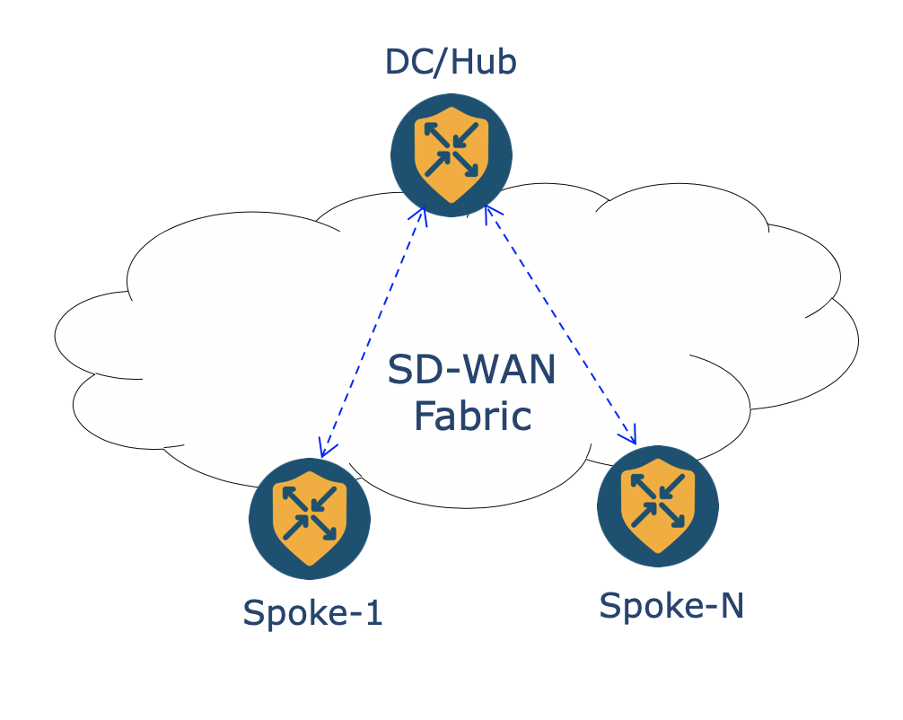

## Aggregation API Constructs

Aggregation API query is created using below constructs  

- Query Conditions

- Aggregation components:

  - Field

  - Histogram

  - Metrics


## Resource URL Structure Components

Resource URL to retrieve app route statistics i.e. latency, loss and jitter  `/statistics/approute/fec/aggregation`

URL : `https://<vmanage-ip>/dataservice/statistics/approute/fec/aggregation`

| Component  | Description  |
| ------ | ------ |
| https://  | Protocol over which data is sent  between client and server |
| Server or Host  | Resolves to the IP and port to which to connect, example : "<vmanage-ip:port>" |
| Resource | The location of the data or object of  interest, example : "/statistics/approute/fec/aggregation" |

Now let’s start using the python script to fetch the app route statistics by using below steps

  - login and authenticate to a vManage instance
  - Run GET request to `https://<vmanage-ip>/dataservice/statistics/approute/fields` to know supported Query fields
  - Build Query to specify the rules on how to retrieve and aggregate app route statistics. 
  - Perform the POST operation by sending query in payload

## App Route Query Fields

**Step-1**

<pre>
On windows command prompt, run command <b>py -3.7 monitor-app-route-stats.py</b> to get the list of options available
in the monitor-app-route-stats.py CLI based python application script.
</pre>

**Sample Response**

```
C:\Users\Administrator\Desktop\sdwan_prog_lab>py -3.7 monitor-app-route-stats.py
Usage: monitor-app-route-stats.py [OPTIONS] COMMAND [ARGS]...

  Command line tool for monitoring Application Aware Routing
  Statistics(Latency/Loss/Jitter/vQoE Score).

Options:
  --help  Show this message and exit.

Commands:
  approute-fields  Retrieve App route Aggregation API Query fields.
  approute-report  Create Average Approute statistics report.
  approute-stats   Create Average Approute statistics for all tunnels...

C:\Users\Administrator\Desktop\sdwan_prog_lab>
```

**Step-2**

<pre>
On windows command prompt, run command <b>py -3.7 monitor-app-route-stats.py approute-fields</b> to get the list of App Route Aggregation API supported Query fields.
</pre>

**Sample Response**

```
C:\Users\Administrator\Desktop\sdwan_prog_lab>py -3.7 monitor-app-route-stats.py approute-fields
vdevice_name(string)  local_system_ip(string)   src_ip(string)    loss_percentage(number)  name(string)
host_name(string)     remote_system_ip(string)  dst_ip(string)    jitter(number)           loss(number)
device_model(string)  local_color(string)       src_port(number)  tx_pkts(number)
statcycletime(date)   remote_color(string)      dst_port(number)  rx_pkts(number)
entry_time(date)      proto(string)             total(number)     tx_octets(number)
vip_idx(number)       window(number)            latency(number)   rx_octets(number)

```

Using these App Route Aggregation API query fields let's define the Aggregation API Query Payload.

## Aggregation API Query Payload

- For vManage Aggregation APIs, we need to define query conditions/rules and based on these rules the data records are extracted from vManage. Some of the common supported rules are to select based on stats entry_time to get statistics in specific interval of time, then use various query fields like local system-ip, local color, remote color to get the records for specific edge routers, transport circuits in that time interval.


### Example-1

-	Below example query retrieves average latency/loss/jitter and vqoe score for last 1 hour for all tunnels between routers with provided `local` and `remote` system-ip
-	The aggregation portion of the query determines how data is bucketized/grouped. 


```
{
  "query": {
    "condition": "AND",
    "rules": [
      {
        "value": [
          "1"
        ],
        "field": "entry_time",
        "type": "date",
        "operator": "last_n_hours"
      },
      {
        "value": [
          "<Router-1 System-IP>"
        ],
        "field": "local_system_ip",
        "type": "string",
        "operator": "in"
      },
      {
        "value": [
          "<Router-2 System-IP>"
        ],
        "field": "remote_system_ip",
        "type": "string",
        "operator": "in"
      }
    ]
  },
  "aggregation": {
    "field": [
      {
        "property": "name",
        "sequence": 1,
        "size": 6000
      }
    ],
    "metrics": [
      {
        "property": "loss_percentage",
        "type": "avg"
      },
      {
        "property": "vqoe_score",
        "type": "avg"
      },
      {
        "property": "latency",
        "type": "avg"
      },
      {
        "property": "jitter",
        "type": "avg"
      }
    ]
  }
}
```

### Example-2

-	Below query retrieves the App route statistics between the start date and end date as query conditions so we get the average latency/loss/jitter between those 2 intervals. (Please note that only UTC timezone is supported in query conditions so we have to convert the user input to UTC timezone if needed)

-	Here, the statistics are aggregated in 24 hours interval so with that we can get a report of statistics for provided start to end date with average of statistics for every day (24 hours).

```
{
      "query": {
          "condition": "AND",
          "rules": [
          {
              "value": [
                        start_date+"T00:00:00 UTC",
                        end_date+"T00:00:00 UTC" 
                       ],
              "field": "entry_time",
              "type": "date",
              "operator": "between"
          },
          {
              "value": [
                      hub["system_ip"]
                      ],
              "field": "local_system_ip",
              "type": "string",
              "operator": "in"
          }
          ]
      },
      "aggregation": {
          "field": [
          {
              "property": "name",
              "size": 6000,
              "sequence": 1
          },
          {
              "property": "proto",
              "sequence": 2
          },
          {
              "property": "local_system_ip",
              "sequence": 3
          },
          {
              "property": "remote_system_ip",
              "sequence": 4
          }
          ],
          "histogram": {
          "property": "entry_time",
          "type": "hour",
          "interval": 24,
          "order": "asc"
          },
          "metrics": [
          {
              "property": "latency",
              "type": "avg"
          },
          {
              "property": "jitter",
              "type": "avg"
          },
          {
              "property": "loss_percentage",
              "type": "avg"
          },
          {
              "property": "vqoe_score",
              "type": "avg"
          }
          ]
      }
      }
```

Using the **Example-1** and **Example-2** query lets perform POST operation on URI to retrieve the app route statistics latency/loss/jitter statistics.

## POST Operation

To fetch the App route statistics we need to perform POST operation by sending the query in payload.

**Step-1**

<pre>
On windows command prompt, run command <b>py -3.7 monitor-app-route-stats.py approute-stats</b> to run <br>POST request using the Query in <b>Example-1</b> i.e to retrieve average latency/loss/jitter and vQoE score between <br>2 routers
for last 1 hour.<br>
Enter `10.1.0.1` as Router-1 System IP address and `10.3.0.1` as Router-2 System IP address.
</pre>

**Sample Response**

```
C:\Users\Administrator\Desktop\sdwan_prog_lab>py -3.7 monitor-app-route-stats.py approute-stats
Enter Router-1 System IP address : 10.1.0.1
Enter Router-2 System IP address : 10.3.0.1

Average App route statistics between 10.1.0.1 and 10.3.0.1 for last 1 hour

╒═════════════════════════════════════════════╤══════════════╤═══════════╤═══════════════════╤═══════════╕
│ Tunnel name                                 │   vQoE score │   Latency │   Loss percentage │    Jitter │
╞═════════════════════════════════════════════╪══════════════╪═══════════╪═══════════════════╪═══════════╡
│ 10.1.0.1:biz-internet-10.3.0.1:biz-internet │           10 │ 19.3356   │                 0 │ 9.02238   │
├─────────────────────────────────────────────┼──────────────┼───────────┼───────────────────┼───────────┤
│ 10.1.0.1:mpls-10.3.0.1:mpls                 │           10 │  0.960481 │                 0 │ 0.0549828 │
╘═════════════════════════════════════════════╧══════════════╧═══════════╧═══════════════════╧═══════════╛

Average App route statistics between 10.3.0.1 and 10.1.0.1 for last 1 hour

╒═════════════════════════════════════════════╤══════════════╤═══════════╤═══════════════════╤════════════╕
│ Tunnel name                                 │   vQoE score │   Latency │   Loss percentage │     Jitter │
╞═════════════════════════════════════════════╪══════════════╪═══════════╪═══════════════════╪════════════╡
│ 10.3.0.1:biz-internet-10.1.0.1:biz-internet │           10 │  17.505   │         0.447436  │ 10.2047    │
├─────────────────────────────────────────────┼──────────────┼───────────┼───────────────────┼────────────┤
│ 10.3.0.1:mpls-10.1.0.1:mpls                 │           10 │   1.27852 │         0.0279648 │  0.0604027 │
╘═════════════════════════════════════════════╧══════════════╧═══════════╧═══════════════════╧════════════╛

```

**Step-2**

<pre>
On windows command prompt, run command <b>py -3.7 monitor-app-route-stats.py approute-report --help</b> to run <br>POST request using the Query in <b>Example-1</b> i.e to retrieve average latency/loss/jitter and vQoE score between <br> Hub and Spoke Routers for provided start to end date.<br>
</pre>

**Sample Response**

```
C:\Users\Administrator\Desktop\sdwan_prog_lab>py -3.7 monitor-app-route-stats.py approute-report --help
Usage: monitor-app-route-stats.py approute-report [OPTIONS]

  Create Average Approute statistics report.
  Provide YAML file which includes list of Hub System IP addresses.
  Example command: ./monitor-app-route-stats.py approute-report
  --hub_list_file <.yaml>

Options:
  --hub_list_file TEXT  YAML file with list of hub system ip addresses
  --help                Show this message and exit.
```


```
C:\Users\Administrator\Desktop\sdwan_prog_lab>more hub_list.yaml
hub_routers:
  - system_ip: 10.1.0.1
  - system_ip: 10.1.0.2
```

**Step-3**

<pre>
On windows command prompt, run command <b>py -3.7 monitor-app-route-stats.py approute-report --hub_list_file hub_list.yaml</b> to run <br>POST request using the Query in <b>Example-2</b> i.e to retrieve average latency/loss/jitter and vQoE score.
</pre>


**Sample Response**

```
C:\Users\Administrator\Desktop\sdwan_prog_lab>py -3.7 monitor-app-route-stats.py approute-report --hub_list_file hub_list.yaml
Please enter start date(YYYY-MM-DD): 2020-06-26
Please enter end date(YYYY-MM-DD): 2020-06-27

Created report of Average App Route statistics for Tunnels between Hub routers and Spokes for 2020-06-26 and 2020-06-27
```

## Conclusion 

# Usecase-4: Alarms APIs

## Objective

Demonstrating retrieval of alarms using Simple Query vManage APIs.
  
## Resource URL Structure Components

`https://<vmanage-ip:port>/dataservice/alarms`

| Component | Description |
| ------ | ------ |
| http:// or https://  | Protocol over which data is sent  between client and server |
| Server or Host  | Resolves to the IP and port to which to connect, example : "<vmanage-ip:port>" |
| Resource | The location of the data or object of  interest, example : "/dataservice/alarms" |


Now let’s start using the python script to fetch the alarms by using below steps

  - login and authenticate to a vManage instance
  - Build Query to specify the rules on how to retrieve alarms
  - Perform the POST operation by sending query in POST request payload

Using `Authentication Class` we will authenticate with vManage and get cookie(JSESSIONID) and Token (Token is retrieved only if vManage version is 19.2 or above). Session Cookie and Token are used in subsequent API calls for validating user session. 

Now lets define the Query which can be used to collect alarms using POST operation on `https://vmanage-ip/dataservice/alarms`

##   Query Payload

###   Example-1

-	Between operator can be used to fetch the alarms for a custom interval for example i.e. 08:50:00 UTC to 8:55:00 UTC ( 5 mins interval )

```
{
  "query": {
    "condition": "AND",         # Logical AND Operation among rules defined below
    "rules": [
      {
        "value": [              # Alarms between 08:50:00 and 08:55:00 on 06/20/2020
          "2020-06-20T08:50:00 UTC",
          "2020-06-20T08:55:00 UTC"
        ],
        "field": "entry_time",
        "type": "date",
        "operator": "between"
      }
    ]
  },
  "size": 10000
}
```

###   Example-2

-	Collect only Active Critical, Medium alarms between 08:50 and 08:55

```
{
  "query": {
    "condition": "AND",      # Logical AND Operation among rules defined below
    "rules": [
      {
        "value": [           # Alarms between 08:50:00 and 08:55:00 on 06/20/2020
          "2020-06-20T08:50:00 UTC",
          "2020-06-20T08:55:00 UTC"
        ],
        "field": "entry_time",
        "type": "date",
        "operator": "between"
      },
      {
        "value": [           # Only alarms with severity level Critical and Medium 
          "Medium",
          "Critical"
        ],
        "field": "severity",
        "type": "string",
        "operator": "in"
      },
      {
        "value": [   
          "true"            # Value is set to false for Cleared alarms and True for active alarms
        ],
        "field": "active",
        "type": "string",
        "operator": "in"
      }
    ]
  },
  "size": 10000
}
```

### Example-3

-	Collect **Active/Cleared** and **Unacknowledged** alarms for specific alarm type/tag for duration of last 24 hours

```
{
    "query": {
        "condition": "AND",         # Logical AND Operation among rules defined below
        "rules": [
        {
            "value": [              # last 24 hours
                "24"
            ],
            "field": "entry_time",
            "type": "date",
            "operator": "last_n_hours"
        },
        {
            "value": [              # Return both active and cleared alarms
            "false","true"
            ],
            "field": "active",
            "type": "string",
            "operator": "in"
        },
        {
            "value": [              # Alarm tag to filter specific type of alarms
            alarm_tag
            ],
            "field": "rule_name_display",
            "type": "string",
            "operator": "in"
        },
        {
            "value":[              # Alarms which are Unacknowledged
                "false",
            ],
            "field": "acknowledged",
            "type": "string",
            "operator": "in"
        }
        ]
    }           
}
```

Using the query in **Example-3** lets perform POST operation on resource URI to retrieve the alarms.

## POST Operation

To fetch the alarms we need to perform POST operation using request method from the python requests library.

Input parameters for POST operation

-   endpoint (vmanage server ip address)
-   resource or mountpoint represented by the URL
-   headers (Content-type and Accept are set to application/json)
-   The query which defines rules on how to retrieve alarms is sent using the payload. 

"verify=False" parameter is passed in POST operation because the SSL verification is disabled.

The result of the POST operation is stored in the response variable. The json() method is called on the response object and the JSON format of the response is returned. "data" key in the JSON output contains the alarm details retrieved.

Now let's have a look at the responses to POST operation

## Sample Responses

-   Every alarm can be uniquely identified based on the uuid value which is associated with it. 
-   In case alarm is cleared, then uuid of alarm which has cleared it is associated with key  `cleared_by` and cleared time is associated with key `cleared_time`

###   Example-1

```
    {
      "values": [
        {
          "color": "biz-internet",
          "system-ip": "10.3.0.1",
          "host-name": "BR1-CEDGE1",
          "site-id": "300"
        }
      ],
      "values_short_display": [
        {
          "color": "biz-internet",
          "system-ip": "10.3.0.1",
          "host-name": "BR1-CEDGE1"
        }
      ],
      "message": "A tloc went down",
      "type": "tloc_down",
      "eventname": "rulename",
      "rulename": "tloc_down",
      "component": "Control",
      "severity": "Major",
      "severity_number": 2,
      "entry_time": 1592776950525,
      "statcycletime": 1592776950525,
      "receive_time": 1592776950525,
      "rule_name_display": "Control_TLOC_Down",
      "uuid": "16d95667-7f0e-4e84-91f3-72497ed7b913",
      "active": false,
      "devices": [
        {
          "color": "biz-internet",
          "system-ip": "10.3.0.1"
        }
      ],
      "consumed_events": [
        {
          "builtBy": "EventDataCollector",
          "vmanage-system-ip": "12.12.12.12",
          "entry_time": 1592776894000,
          "eventname": "control-connection-state-change",
          "linkupdate": true,
          "component": "Control",
          "severity-level": "major",
          "system-ip": "12.12.12.12",
          "host-name": "vSmart-1",
          "personality": "vsmart",
          "peer-type": "vedge",
          "peer-system-ip": "10.3.0.1",
          "peer-vmanage-system-ip": "0.0.0.0",
          "public-ip": "100.64.2.2",
          "public-port": "5079",
          "src-color": "default",
          "remote-color": "biz-internet",
          "uptime": "0:00:20:30",
          "new-state": "down",
          "receive_time": 1592776890527,
          "eventId": "a5dc4d54-f491-4d9d-91bb-8a68f4a88e9f",
          "eventCreationTime": 1592776890540
        },
        {
          "builtBy": "EventDataCollector",
          "vmanage-system-ip": "22.22.22.22",
          "entry_time": 1592776893000,
          "eventname": "control-connection-state-change",
          "linkupdate": true,
          "component": "Control",
          "severity-level": "major",
          "system-ip": "22.22.22.22",
          "host-name": "vSmart-2",
          "personality": "vsmart",
          "peer-type": "vedge",
          "peer-system-ip": "10.3.0.1",
          "peer-vmanage-system-ip": "0.0.0.0",
          "public-ip": "100.64.2.2",
          "public-port": "5079",
          "src-color": "default",
          "remote-color": "biz-internet",
          "uptime": "0:00:20:30",
          "new-state": "down",
          "receive_time": 1592776890525,
          "eventId": "3c4c1063-b1cd-478b-81af-a26f47c8b638",
          "eventCreationTime": 1592776890538
        },
        {
          "builtBy": "EventDataCollector",
          "vmanage-system-ip": "10.10.10.10",
          "entry_time": 1592776890000,
          "eventname": "control-connection-state-change",
          "linkupdate": true,
          "component": "Control",
          "severity-level": "major",
          "system-ip": "10.10.10.10",
          "host-name": "vManage",
          "personality": "vmanage",
          "peer-type": "vedge",
          "peer-system-ip": "10.3.0.1",
          "peer-vmanage-system-ip": "0.0.0.0",
          "public-ip": "100.64.2.2",
          "public-port": "5079",
          "src-color": "default",
          "remote-color": "biz-internet",
          "uptime": "0:00:20:30",
          "new-state": "down",
          "receive_time": 1592776890524,
          "eventId": "69a504d1-7f09-4d43-80ff-2404b615969b",
          "eventCreationTime": 1592776890539
        }
      ],
      "acknowledged": false,
      "possible_causes": [
        "Trying to determine possible root causes"
      ],
      "tenant": "default",
      "cleared_by": "e8bd6f6e-0be0-429d-b5c8-e0bd90ef4989",
      "cleared_time": 1592776967212,
      "id": "AXLY54rgGEYcfPHKCx0_"
    }
```

`entry_time` and `cleared_time` values are in epoch format.

**Step-1**

<pre>
On windows command prompt run the command <b>py -3.7 alarms_apis.py</b> to see all the options supported
by the script
</pre>

**Sample Response**

```
C:\Users\Administrator\Desktop\sdwan_prog_lab>
C:\Users\Administrator\Desktop\sdwan_prog_lab>py -3.7 alarms_apis.py
Usage: alarms_apis.py [OPTIONS] COMMAND [ARGS]...

  Command line tool for deploying templates to CISCO SDWAN.

Options:
  --help  Show this message and exit.

Commands:
  ack-alarm         Acknowledge specific alarms of provided uuids.
  alarm-details     Retrieve consumed event details for provided alarm uuid.
  list-alarms       Retrieve list of alarms related to provided tag.
  list-alarms-tags  Retrieve list of alarm tags.
```

**Step-2**

Run the script with `list-alarm-tags` option i.e. `py -3.7 alarms_apis.py list-alarms-tags`  to see all the alarm names/tags supported.

```
C:\Users\Administrator\Desktop\sdwan_prog_lab>py -3.7 alarms_apis.py list-alarms-tags

Retrieving the alarm tags

BFD_Node_Up               OMP_All_Vsmarts_Down                 Device Upgrade Failed
BFD_Between_Sites_Down    OMP_Site_Up                          Container upgrade failed
BFD_TLOC_Up               OMP_Node_Up                          New_CSR_Generated
BFD_TLOC_Down             BGP_Router_Down                      Root_Cert_Chain_Uninstalled
BFD_Site_Down             BGP_Router_Up                        Default App List Update
BFD_Site_Up               OSPF_Router_Down                     Interface_State_Change
BFD_Node_Down             OSPF_Router_Up                       aaa_Admin_Password_Change
BFD_Between_Sites_Up      Container reload failed              Unsupported_SFP_Detected
Control_Vsmart_Down       System_IP_Reuse                      Device Activation Failed
Control_Vsmart_Up         Pim_Interface_State_Change           System_Reboot_Issued
Control_Site_Down         Interface_Admin_State_Change         Devices Have No License Associated
Control_TLOC_Down         Container activate failed            Clear_Installed_Certificate
Control_Vmanage_Up        System-IP_Change                     Cloud On Ramp
Control_Site_Up           DHCP_Server_State_Change             UTD signature package installation failed
Control_Vmanage_Down      OMP_State_Change                     Org_Name_Change
Control_Vsmarts_Up        Site-ID_Change                       Container reset failed
Control_Node_Up           Disk_Usage                           ZTP Upgrade Failed
Control_TLOC_Up           Domain-ID_Change                     Pseudo_Commit_Status
Control_Node_Down         Memory_Usage                         Container App installation failed
Control_All_Vsmarts_Down  CPU_Load                             Control_vBond_State_Change
OMP_Site_Down             vEdge_Serial_File_Uploaded           Template_Rollback
OMP_Node_Down             Cloned_Vedge_Detected                Root_Cert_Chain_Installed
OMP_Vsmarts_Up            vSmart/vManage_Serial_File_Uploaded  Process_Restart


C:\Users\Administrator\Desktop\sdwan_prog_lab>
```

**Step-3**

Let's use the `Control_TLOC_Down` alarm tag to get all the Control TLOC Down alarms in the Overlay fabric.

Run the script `py -3.7 alarms_apis.py list-alarms --alarm_tag Control_TLOC_Down`

Script uses the Simple Query payload from **Example-3** to query for all alarms with the provided  tag for last 24 hours which are unknowledged. 

```
C:\Users\Administrator\Desktop\sdwan_prog_lab>py -3.7 alarms_apis.py list-alarms --help
Usage: alarms_apis.py list-alarms [OPTIONS]

  Retrieve list of alarms related to provided tag.          
  Example command: ./alarms_apis.py list-alarms --alarm_tag OMP_Site_Up

Options:
  --alarm_tag TEXT  Alarm tag name
  --help            Show this message and exit.

C:\Users\Administrator\Desktop\sdwan_prog_lab>
```

```
C:\Users\Administrator\Desktop\sdwan_prog_lab>py -3.7 alarms_apis.py list-alarms --alarm_tag Control_TLOC_Down

Retrieving the alarms with tag Control_TLOC_Down

╒═════════════════════╤═══════════════════╤══════════╤══════════╤════════════╤══════════════════════════════════════════════════╕
│ Date & Time (PDT)   │ Alarm tag         │ Active   │ Viewed   │ Severity   │ Details                                          │
╞═════════════════════╪═══════════════════╪══════════╪══════════╪════════════╪══════════════════════════════════════════════════╡
│ 06/21/2020 14:41:42 │ Control_TLOC_Down │ False    │ False    │ Major      │ UUID: dfdd7822-6c19-49f3-844b-47402ff1d616       │
│                     │                   │          │          │            │ Values:                                          │
│                     │                   │          │          │            │ [                                                │
│                     │                   │          │          │            │     {                                            │
│                     │                   │          │          │            │         "color": "biz-internet",                 │
│                     │                   │          │          │            │         "host-name": "BR1-CEDGE1",               │
│                     │                   │          │          │            │         "site-id": "300",                        │
│                     │                   │          │          │            │         "system-ip": "10.3.0.1"                  │
│                     │                   │          │          │            │     }                                            │
│                     │                   │          │          │            │ ]                                                │
│                     │                   │          │          │            │ Cleared By: 0fa4319d-3173-4918-93aa-4b064d46a3c2 │
│                     │                   │          │          │            │ Cleared Time: 06/21/2020 14:41:59 PDT            │
╘═════════════════════╧═══════════════════╧══════════╧══════════╧════════════╧══════════════════════════════════════════════════╛

C:\Users\Administrator\Desktop\sdwan_prog_lab>

```

**Step-4**

In Cisco SD-WAN solution components (Controllers and Edge routers) sends various events to vManage. on vManage, these events go through the Alarms Engine which correlates the events and then triggers alarms. 

For example when Control Connection goes down, vManage recieves the Control connection state change events from controllers and edge routers. Alarms engine co-relates these events and then triggers the Control TLOC Down/Up alarm respectively.

Using the API end point `/alarms/uuid/<uuid-value>` we can retrieve the details of all the consumed events which has triggered that specific alarm. 

Now let's run the script `py -3.7 alarms_apis.py alarm-details --uuid <uuid-value>` to retrieve the consumed events for a given alarm with provided uuid value.

Copy the uuid-value from the output in **Step-3**

**Sample Response**

Use `--help` option to see the supported inputs specific command option

```
C:\Users\Administrator\Desktop\sdwan_prog_lab>py -3.7 alarms_apis.py alarm-details --help
Usage: alarms_apis.py alarm-details [OPTIONS]

  Retrieve consumed event details for provided alarm uuid.          
  Example command: ./alarms_apis.py alarm-details --uuid <alarm uuid value>

Options:
  --uuid TEXT  Alarm uuid
  --help       Show this message and exit.

C:\Users\Administrator\Desktop\sdwan_prog_lab>
```

Sample output of consumed events for the alarm with uuid value `dfdd7822-6c19-49f3-844b-47402ff1d616`

```
C:\Users\Administrator\Desktop\sdwan_prog_lab>py -3.7 alarms_apis.py alarm-details --uuid dfdd7822-6c19-49f3-844b-47402ff1d616

Retrieving the consumed events for uuid dfdd7822-6c19-49f3-844b-47402ff1d616

╒═════════════════════╤═══════════════════╤══════════╤══════════╤════════════════════════════════════════════════════════════╕
│ Date & Time (PDT)   │ Alarm tag         │ Active   │ Viewed   │ Consumed Events                                            │
╞═════════════════════╪═══════════════════╪══════════╪══════════╪════════════════════════════════════════════════════════════╡
│ 06/21/2020 14:41:42 │ Control_TLOC_Down │ False    │ False    │ [                                                          │
│                     │                   │          │          │     {                                                      │
│                     │                   │          │          │         "builtBy": "EventDataCollector",                   │
│                     │                   │          │          │         "component": "Control",                            │
│                     │                   │          │          │         "entry_time": 1592775645000,                       │
│                     │                   │          │          │         "eventCreationTime": 1592775642877,                │
│                     │                   │          │          │         "eventId": "256a6b8a-c84e-41ec-b339-0e7707293ba8", │
│                     │                   │          │          │         "eventname": "control-connection-state-change",    │
│                     │                   │          │          │         "host-name": "vSmart-2",                           │
│                     │                   │          │          │         "linkupdate": true,                                │
│                     │                   │          │          │         "new-state": "down",                               │
│                     │                   │          │          │         "peer-system-ip": "10.3.0.1",                      │
│                     │                   │          │          │         "peer-type": "vedge",                              │
│                     │                   │          │          │         "peer-vmanage-system-ip": "0.0.0.0",               │
│                     │                   │          │          │         "personality": "vsmart",                           │
│                     │                   │          │          │         "public-ip": "100.64.2.2",                         │
│                     │                   │          │          │         "public-port": "5079",                             │
│                     │                   │          │          │         "receive_time": 1592775642867,                     │
│                     │                   │          │          │         "remote-color": "biz-internet",                    │
│                     │                   │          │          │         "severity-level": "major",                         │
│                     │                   │          │          │         "src-color": "default",                            │
│                     │                   │          │          │         "system-ip": "22.22.22.22",                        │
│                     │                   │          │          │         "uptime": "1:19:48:29",                            │
│                     │                   │          │          │         "vmanage-system-ip": "22.22.22.22"                 │
│                     │                   │          │          │     },                                                     │
│                     │                   │          │          │     {                                                      │
│                     │                   │          │          │         "builtBy": "EventDataCollector",                   │
│                     │                   │          │          │         "component": "Control",                            │
│                     │                   │          │          │         "entry_time": 1592775646000,                       │
│                     │                   │          │          │         "eventCreationTime": 1592775642871,                │
│                     │                   │          │          │         "eventId": "00c506f5-6d4e-4a5b-9c9f-5b83468edd81", │
│                     │                   │          │          │         "eventname": "control-connection-state-change",    │
│                     │                   │          │          │         "host-name": "vSmart-1",                           │
│                     │                   │          │          │         "linkupdate": true,                                │
│                     │                   │          │          │         "new-state": "down",                               │
│                     │                   │          │          │         "peer-system-ip": "10.3.0.1",                      │
│                     │                   │          │          │         "peer-type": "vedge",                              │
│                     │                   │          │          │         "peer-vmanage-system-ip": "0.0.0.0",               │
│                     │                   │          │          │         "personality": "vsmart",                           │
│                     │                   │          │          │         "public-ip": "100.64.2.2",                         │
│                     │                   │          │          │         "public-port": "5079",                             │
│                     │                   │          │          │         "receive_time": 1592775642853,                     │
│                     │                   │          │          │         "remote-color": "biz-internet",                    │
│                     │                   │          │          │         "severity-level": "major",                         │
│                     │                   │          │          │         "src-color": "default",                            │
│                     │                   │          │          │         "system-ip": "12.12.12.12",                        │
│                     │                   │          │          │         "uptime": "1:19:48:30",                            │
│                     │                   │          │          │         "vmanage-system-ip": "12.12.12.12"                 │
│                     │                   │          │          │     }                                                      │
│                     │                   │          │          │ ]                                                          │
╘═════════════════════╧═══════════════════╧══════════╧══════════╧════════════════════════════════════════════════════════════╛

C:\Users\Administrator\Desktop\sdwan_prog_lab>
```

**Step-5**

Once Alarms are consumed/reviewed by the Network Operations team, we can mark those Alarms as viewed and filter out those viewed alarms in the response for subsequent API calls used to poll the Alarms. 

In order to ack alarm, run the POST request to API end point `/alarms/markviewed` with POST below  payload request.

```
{
    "uuid" : <list of alarm uuids to be marked as viewed>
}
```
**Sample Response**

Use `--help` option to see the supported inputs specific command option

```
C:\Users\Administrator\Desktop\sdwan_prog_lab>py -3.7 alarms_apis.py ack-alarm --help
Usage: alarms_apis.py ack-alarm [OPTIONS]

  Acknowledge specific alarms of provided uuids.
  Example command: ./alarms_apis.py ack-alarm --uuid <alarm uuid value>
  To ack multiple uuids seperate uuid using "," i.e. --uuid uuid-1,uuid-2

Options:
  --uuids TEXT  Alarm uuid/s
  --help        Show this message and exit.

C:\Users\Administrator\Desktop\sdwan_prog_lab>
```


```
C:\Users\Administrator\Desktop\sdwan_prog_lab>py -3.7 alarms_apis.py ack-alarm --uuids dfdd7822-6c19-49f3-844b-47402ff1d616
Acknowledged the alarms with uuid ['dfdd7822-6c19-49f3-844b-47402ff1d616']

C:\Users\Administrator\Desktop\sdwan_prog_lab>
```

**Step-6**

```
C:\Users\Administrator\Desktop\sdwan_prog_lab>py -3.7 alarms_apis.py list-alarms --alarm_tag Control_TLOC_Down

Retrieving the alarms with tag Control_TLOC_Down

╒═════════════════════╤═════════════╤══════════╤══════════╤════════════╤═══════════╕
│ Date & Time (PDT)   │ Alarm tag   │ Active   │ Viewed   │ Severity   │ Details   │
╞═════════════════════╪═════════════╪══════════╪══════════╪════════════╪═══════════╡
╘═════════════════════╧═════════════╧══════════╧══════════╧════════════╧═══════════╛

C:\Users\Administrator\Desktop\sdwan_prog_lab>
```

**Note:** You would see different output based on the alarms reported in vManage of your dcloud setup. 

## Conclusion

In this section we have learned how to build Query to diferent scenarios to retrieve the alarms and how to parse the alarms data i.e. recieved from the vManage.  

# Usecase-5: Webhook 

-   Webhooks enable push-model mechanism to send notifications in real-time.
-   Polling for Alarms is expensive!
-   Webhooks are sometimes referred to as **Reverse APIs**
-   With Webhook Notifications enabled, when vManage recieves alarms, it sends HTTP POST request with alarm details to the external systems in real-time.
-   We need to design an API route to process the data sent via Webhook.

## Objective

Enable webhooks on vManage and write API route to consume the data sent from vManage to webhook server. 

## Prerequisites

-  This feature is supported from vManage 18.3 release onwards

## Configure

Steps to enable webhook notifications for pushing alarms to external systems.

**Step-1:**

- Select **Email Notifications** from **Monitor -> Alarms**

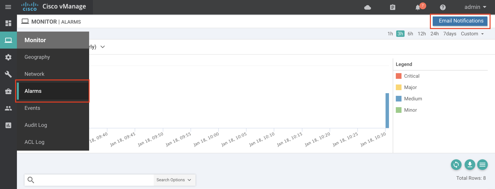

**Step-2:**

- Click on **Add Email Notification**


**Step-3:**

- Enter Notification rule name : <b>sevt-webhooks</b>
- Select severity level : <b>Critical</b>
- Select Alarm Name : <b>System Reboot Issued</b>

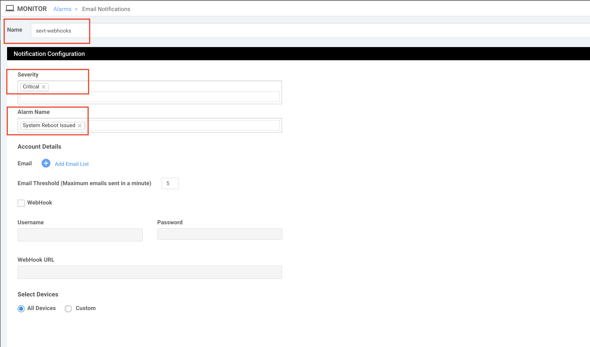

**Step-4:**

- Click on <b>Add Email list</b> and then <b>Add Email</b>
- Enter dummy email-id **test@test.com** , as we are using only webhooks in this lab

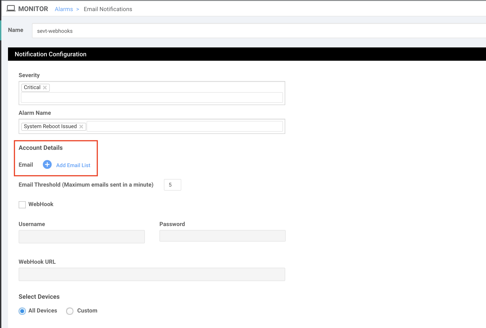

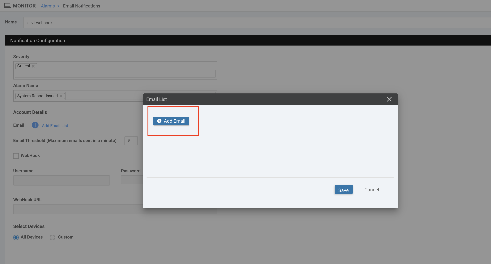

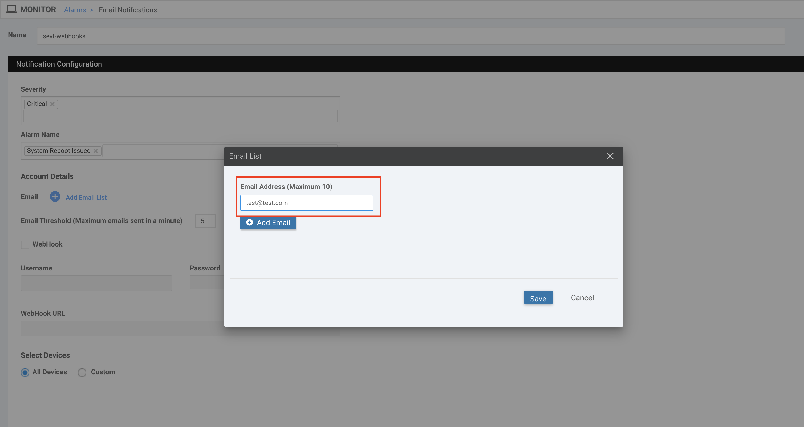

**Step-5:**

- Enable webhook checkbox.
- Provide the webhook server URL, username and password. 
- Username : **sevt**
- Password : **sevt**
- Webhook Server URL : http://198.18.133.36:5001/

- Select **All Devices** and click on **Add** to complete the webhook settings.

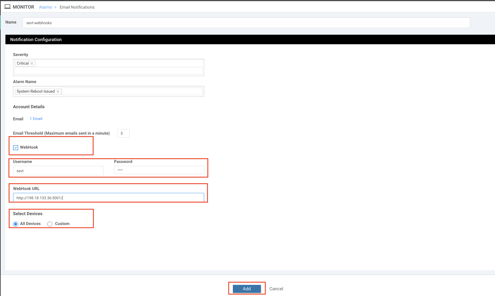

**Step-6:**

- Select `Administration -> Settings`.

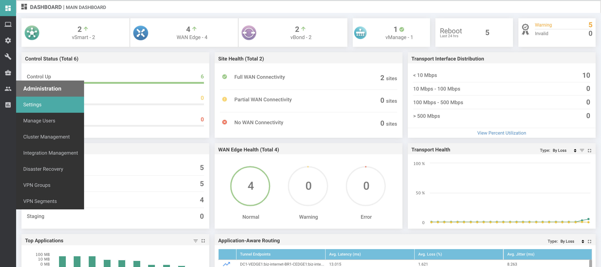

- Click on `Edit` for `Email Notifications` 


- Enter dummy email address and SMTP server details as we are using only Webhook Notifications in this lab.

- Select `Enabled` radio button
- SMTP Server : `test.mail.com`
- SMTP Port : `25`
- From address : `test@test.com`
- Reply to address : `test@test.com`
- Click Save to enable Email/Webhook Notifications


#	Notifications Dashboard 

List of Notifications rules configured can be seen in section **Alarms -> Email Notifications**

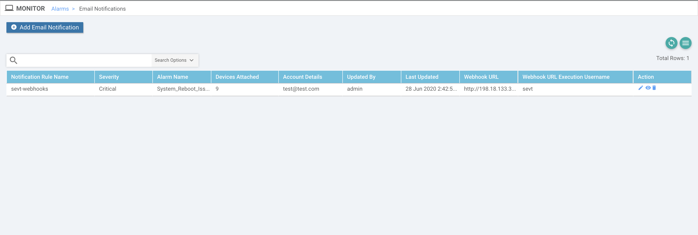


## Set up Webhook server on Windows VM

Now let’s try to set up webhook server on windows VM to accept notifications sent from vManage

- In order to accept HTTP post requests sent from vManage, we need to enable http web server and design API route.
- Below code spins up flask web server listening on port 5001 for HTTP POST request
- Defined alarms() functions accepts the POST request at route `http://server-ip:port/` and extracts the data from request.

```
from flask import Flask, request, jsonify
from flask_basicauth import BasicAuth
import json
import datetime
import pytz

app = Flask(__name__)

app.config['BASIC_AUTH_USERNAME'] = 'sevt'
app.config['BASIC_AUTH_PASSWORD'] = 'sevt'

basic_auth = BasicAuth(app)

@app.route('/',methods=['POST'])
@basic_auth.required
def alarms():
   try:
      data = json.loads(request.data)
      print(data)
      PDT = pytz.timezone('America/Los_Angeles')
            
      temp_time = datetime.datetime.utcfromtimestamp(data['entry_time']/1000.)
      temp_time = pytz.UTC.localize(temp_time).astimezone(PDT).strftime('%m/%d/%Y %H:%M:%S') + ' PDT'

      table = list()
      headers = ["Date & Time (PDT)", "Alarm Name" , "Severity", "Details" ]

      tr = [ temp_time, data['rule_name_display'] , data['severity'], 
             "UUID: " + data["uuid"] + "\nValues:\n" + json.dumps(data["values"] , sort_keys=True, indent=4) ]
      
      table.append(tr)
        
      try:
          print(tabulate.tabulate(table, headers, tablefmt="fancy_grid"))
      except UnicodeEncodeError:
          print(tabulate.tabulate(table, headers, tablefmt="grid"))
      
   except Exception as exc:
      print(exc)
      return jsonify(str(exc)), 500
   
   return jsonify("Parsed Webhook Notification Successfully"), 200

if __name__ == '__main__':
   app.run(host='0.0.0.0', port=5001, debug=True)
```

## Enable Webhook Server

**Step-1:**

On windows command prompt, run the command `py -3.7 webhook.py` to spin up http webhook server.

**Sample Response**

```
C:\Users\Administrator\Desktop\sdwan_prog_lab>py -3.7 webhook.py
 * Serving Flask app "webhook" (lazy loading)
 * Environment: production
   WARNING: Do not use the development server in a production environment.
   Use a production WSGI server instead.
 * Debug mode: on
 * Restarting with stat
 * Debugger is active!
 * Debugger PIN: 213-160-007
 * Running on http://0.0.0.0:5001/ (Press CTRL+C to quit)
```

**Step-2**

- Login to mputty software and select any device (Branch routers or DC routers)
- Login details for BR or DC routers is username/password : admin/admin
- Command to initiate reload is `reload` for `cEdge` router and `reboot now`  for `vEdge` router.


Once alarm is received on vManage, vManage pushes the notification to webhook server and below is the sample output on webhook server on receiving notifications from the vManage.

**Sample Response**

**Webhook Notification (JSON format):**

```
{
  "devices": [
    {
      "system-ip": "10.1.0.1"
    }
  ],
  "eventname": "system-reboot-issued",
  "type": "system-reboot-issued",
  "rulename": "system-reboot-issued",
  "component": "System",
  "entry_time": 1593378752000,
  "statcycletime": 1593378752000,
  "message": "The device rebooted",
  "severity": "Critical",
  "severity_number": 1,
  "uuid": "6c6b76ed-074f-452a-9484-8e5277f5930c",
  "values": [
    {
      "host-name": "DC1-VEDGE1",
      "system-ip": "10.1.0.1",
      "reboot-reason": "Initiated by user"
    }
  ],
  "rule_name_display": "System_Reboot_Issued",
  "receive_time": 1593378751326,
  "values_short_display": [
    {
      "host-name": "DC1-VEDGE1",
      "system-ip": "10.1.0.1"
    }
  ],
  "acknowledged": false,
  "active": true
}
```

Script `webhook.py` parses the webhook notification and creates a table in below format with alarm details

**Sample response for DC1-VEDGE1 router reboot alarm**

```
╒═════════════════════════╤══════════════════════╤════════════╤═══════════════════════════════════════════════╕
│ Date & Time (PDT)       │ Alarm Name           │ Severity   │ Details                                       │
╞═════════════════════════╪══════════════════════╪════════════╪═══════════════════════════════════════════════╡
│ 06/28/2020 14:20:16 PDT │ System_Reboot_Issued │ Critical   │ UUID: c8cd1f41-06de-4907-bbd0-2c76cdd13f6f    │
│                         │                      │            │ Values:                                       │
│                         │                      │            │ [                                             │
│                         │                      │            │     {                                         │
│                         │                      │            │         "host-name": "DC1-VEDGE1",            │
│                         │                      │            │         "reboot-reason": "Initiated by user", │
│                         │                      │            │         "system-ip": "10.1.0.1"               │
│                         │                      │            │     }                                         │
│                         │                      │            │ ]                                             │
╘═════════════════════════╧══════════════════════╧════════════╧═══════════════════════════════════════════════╛
198.18.1.10 - - [28/Jun/2020 17:20:18] "←[37mPOST / HTTP/1.1←[0m" 200 -
```

**Sample response for BR1-CEDGE1 router reboot alarm**

```
╒═════════════════════════╤══════════════════════╤════════════╤════════════════════════════════════════════╕
│ Date & Time (PDT)       │ Alarm Name           │ Severity   │ Details                                    │
╞═════════════════════════╪══════════════════════╪════════════╪════════════════════════════════════════════╡
│ 06/28/2020 14:20:43 PDT │ System_Reboot_Issued │ Critical   │ UUID: 0685234d-c5a6-43fd-802e-28ff76b8a915 │
│                         │                      │            │ Values:                                    │
│                         │                      │            │ [                                          │
│                         │                      │            │     {                                      │
│                         │                      │            │         "host-name": "BR1-CEDGE1",         │
│                         │                      │            │         "reboot-reason": "Reload Command", │
│                         │                      │            │         "system-ip": "10.3.0.1"            │
│                         │                      │            │     }                                      │
│                         │                      │            │ ]                                          │
╘═════════════════════════╧══════════════════════╧════════════╧════════════════════════════════════════════╛
198.18.1.10 - - [28/Jun/2020 17:21:03] "←[37mPOST / HTTP/1.1←[0m" 200 -
```

## Alarms on vManage

-	Above webhook logs corresponds to these alarms which were recieved by vManage.


## Conclusion

In this section, we learned how to enable webhook notifications on the vManage and how to build the API route to process the data recieved from vManage via webhook notifications.

# References

[sdwan docs](https://sdwan-docs.cisco.com/Product_Documentation/Command_Reference/vManage_REST_APIs/vManage_REST_APIs_Overview/Using_the_vManage_REST_APIs)

